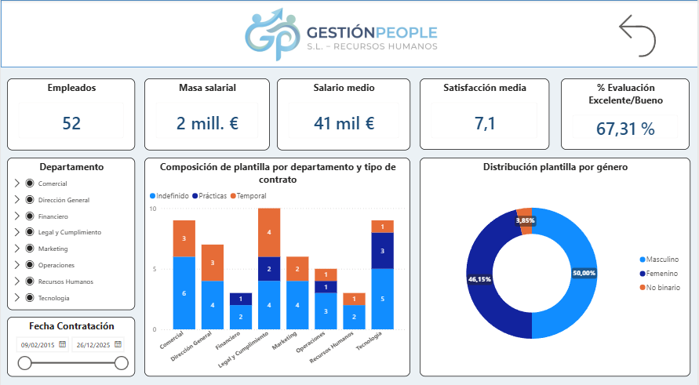

# 📊 Power BI Gestión People

    

*Sistema integral de inteligencia de negocios para el análisis multidimensional del capital humano, equidad salarial y desarrollo del talento corporativo.*

---

## 📸 Vista Previa del Dashboard

Aquí puedes ver una captura del panel principal de **Gestión People**, donde se centralizan los KPIs de capital humano, la distribución de la plantilla por género, departamento y tipo de contrato.



---

## 🔗 Acceso / Demo

El informe está distribuido como una plantilla de Power BI (`.pbit`) parametrizada (`Path_Excel`), permitiendo desacoplar la capa de visualización y lógica de la fuente de datos local:

- **Modo Local**: Compatible con **Power BI Desktop** (versión 2026 o superior) mediante parametrización dinámica del origen Excel.
- **Despliegue Corporativo**: Listo para su publicación directa en **Power BI Service**, vinculable a puertas de enlace de datos (On-Premises Data Gateway) o almacenamiento cloud en Microsoft SharePoint / Microsoft Fabric.

---

## 📋 Descripción

**Power BI Gestión People** es una solución analítica integral de Business Intelligence diseñada para transformar la gestión estratégica de Recursos Humanos y People Analytics. Resuelve la fragmentación operativa provocada por el uso de múltiples hojas de cálculo desconectadas, unificando registros de personal, estructuras departamentales y planes de capacitación continua en un único modelo relacional en estrella.

La plataforma implementa un pipeline automatizado de extracción, transformación y carga (ETL) en **Power Query (Lenguaje M)** que garantiza tipado estricto e integridad referencial. A través de un motor de cálculo modelado en **DAX**, el sistema calcula KPIs críticos de rendimiento, distribución demográfica, equidad retributiva por género y correlación entre inversión formativa y satisfacción laboral.

Diseñado específicamente para directores de Recursos Humanos, especialistas en People Analytics y comités de dirección, este dashboard elimina los informes estáticos manuales y proporciona un entorno interactivo con filtrado cruzado, análisis temporal y visualizaciones geoespaciales avanzadas.

---

## ✨ Funcionalidades

| Funcionalidad | Descripción |
| :--- | :--- |
| **Resumen y Dashboard Ejecutivo** | Panel de control centralizado con más de 5 tarjetas KPI (`Cards`), gráficos de anillo (`Donut`), columnas y segmentadores dinámicos cruzados. |
| **Análisis de Brecha Salarial** | Evaluación de equidad retributiva por género y departamento mediante `ComboChart` y tablas dinámicas impulsadas por la medida `Brecha Salarial Genero %`. |
| **Mapa Geoespacial de Talento** | Visualización geográfica de la plantilla utilizando `FilledMaps` y matrices de densidad por Comunidad Autónoma, Provincia y Ciudad. |
| **Matriz de Formación y Satisfacción** | Análisis de correlación mediante `ScatterChart` cruzando horas acumuladas, coste por acción formativa y nivel de satisfacción del empleado (escala 1-10). |
| **Evaluación Cuantitativa de Desempeño** | Transformación de evaluaciones cualitativas en índices numéricos (`Evaluacion Numerica`) y cálculo del `% Evaluacion Excelente/Bueno`. |
| **Gestión y Control de Contratación** | Monitorización de estabilidad laboral calculando el ratio `% Indefinidos` frente a contratos temporales y de prácticas. |
| **Inteligencia Temporal y Formato Condicional** | Análisis de ventanas móviles (`Horas Ultimo Año`) y formateo dinámico de tablas (`Color Fondo Tabla`) según umbrales de excelencia y dedicación. |

---

## ⚙️ Instalación

1. **Clonar o descargar el repositorio**:
   ```bash
   git clone https://github.com/migueljerico/powerbi-gestion-people.git
   cd powerbi-gestion-people
   ```

2. **Verificar el archivo de datos**:
   Asegúrate de disponer del archivo de datos estructurado `GestionPeople_Dataset_PowerBI.xlsx` con las hojas `Empleados`, `Departamentos` y `RegistroFormacion`.

3. **Abrir la plantilla en Power BI Desktop**:
   Haz doble clic sobre el archivo de plantilla:
   ```text
   GestionPeople_Informe.19062026.pbit
   ```

4. **Configurar el parámetro de origen**:
   Al abrirse el asistente interactivo, introduce la ruta absoluta del archivo Excel de origen en el parámetro `Path_Excel`:
   ```powershell
   C:\Ruta\Hacia\GestionPeople_Dataset_PowerBI.xlsx
   ```

5. **Cargar y validar el modelo**:
   Pulsa en **Cargar**. Power Query ejecutará las transformaciones M tipadas (`Empleados_final`, `Departamentos_final`, `Registro formacion_final`), regenerará las relaciones del modelo y renderizará las 8 páginas analíticas.

---

## 🚀 Uso

### 1. Navegación por Módulos Analíticos
El informe cuenta con navegación por botones y pestañas temáticas:
- **Resumen Ejecutivo**: Vista macro del estado de la organización, plantilla total y distribución contractual.
- **Análisis Brecha Salarial de Género**: Comparativa salarial directa entre géneros para auditorías de equidad retributiva.
- **Mapa de Talento / Distribución Geográfica**: Análisis territorial de densidad de empleados.
- **Formación y Satisfacción**: Correlación de horas lectivas vs. desempeño y satisfacción laboral.

### 2. Principales Medidas DAX Implementadas

* **Cálculo de Brecha Salarial de Género**:
  ```dax
  Brecha Salarial Genero % = 
  VAR SalarioHombres = CALCULATE(AVERAGE(Empleados_final[Salario]), Empleados_final[Genero] = "Masculino")
  VAR SalarioMujeres = CALCULATE(AVERAGE(Empleados_final[Salario]), Empleados_final[Genero] = "Femenino")
  RETURN
  DIVIDE(SalarioHombres - SalarioMujeres, SalarioHombres, 0)
  ```

* **Conversión Cuantitativa de Desempeño**:
  ```dax
  Evaluacion Numerica = 
  SWITCH(
      SELECTEDVALUE(Empleados_final[Evaluacion]),
      "Excelente", 4,
      "Bueno", 3,
      "Aceptable", 2,
      "Mejorable", 1,
      0
  )
  ```

* **Formato Condicional Dinámico**:
  ```dax
  Color Fondo Tabla = 
  IF(
      SELECTEDVALUE(Empleados_final[HorasFormacion]) > 40 && 
      SELECTEDVALUE(Empleados_final[Evaluacion]) = "Excelente",
      "#92D050",
      BLANK()
  )
  ```

---

## 📁 Estructura del proyecto

```text
powerbi-gestion-people/
├── LICENSE                                 # Licencia de código abierto MIT
├── MANUAL_TECNICO.md                       # Manual de arquitectura, flujo ETL y medidas DAX
├── README.md                               # Documentación principal del proyecto
└── docs/
    ├── GestionPeople_Dataset_PowerBI.md    # Diccionario de datos y estructura de tablas
    └── GestionPeople_Informe.19062026.md   # Especificación técnica del informe y visuales
```

---

## 🛠️ Tecnologías

| Herramienta | Versión/Detalle | Uso en el proyecto |
| :--- | :--- | :--- |
| **Microsoft Power BI Desktop** | 2026 | Entorno principal de modelado dimensional, relaciones y diseño visual. |
| **Power Query (Lenguaje M)** | Engine Integrado | Limpieza ETL, tipado estricto de columnas y parametrización dinámica de rutas. |
| **DAX (Data Analysis Expressions)** | Tabular | Creación de métricas de negocio, ratios salariales, KPIs e inteligencia temporal. |
| **Microsoft Excel** | XLSX Relacional | Almacén de datos fuente normalizado (`Empleados`, `Departamentos`, `RegistroFormacion`). |
| **Time Intelligence Engine** | `LocalDateTable` / Templates | Gestión de series cronológicas, agregaciones anuales (YoY) y ventanas móviles. |

---

## 📚 Contexto formativo o motivación del proyecto

Este proyecto fue desarrollado en el marco del módulo formativo **IFCT153 "Análisis de Datos con Excel: Power Query, Power Pivot y Power BI"**.

Su propósito es reproducir un caso de uso corporativo completo para la empresa ficticia **GestiónPeople S.L.**, aplicando las mejores prácticas de la industria en:
- Normalización y preparación de datos sin redundancias.
- Modelado relacional en estrella con granularidad mixta.
- Cumplimiento de normativas de auditoría de brecha de género y reporting ejecutivo.
- Creación de plantillas portables (`.pbit`) preparadas para entornos de producción empresarial.

---

## 📄 Licencia

Este proyecto se distribuye bajo la licencia **MIT**. Consulta el archivo [LICENSE](LICENSE) para obtener más detalles.

<p align="center">Creado por <a href="https://github.com/migueljerico">@migueljerico</a> y documentado por Google Gemini (gemini-3.7-flash) desde la App Asistente de IA · 2026</p>
